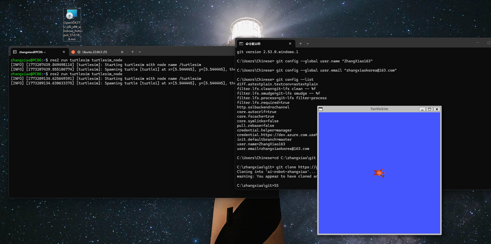

# Week 02 - Ubuntu 与 ROS2 环境安装

本周完成 Ubuntu/WSL2 开发环境搭建，并成功运行 ROS2 turtlesim 小乌龟示例，为后续机器人控制实验打下基础。

## 本周目标

- 在 Windows 环境中安装 WSL2 与 Ubuntu。
- 配置 ROS2 Humble 开发环境。
- 学会使用终端运行 ROS2 示例程序。
- 验证 turtlesim 图形窗口可以正常启动。

## 文件说明

| 文件 | 说明 |
| :--- | :--- |
| `README.md` | 本周安装与运行记录。 |
| `runTurtle.png` | turtlesim 成功运行截图。 |

## 安装步骤

1. 在 Microsoft Store 中安装 Ubuntu，或在终端中执行：

```bash
wsl --install
```

2. 打开 Ubuntu 终端，使用 FishROS 一键安装脚本配置 ROS2：

```bash
wget http://fishros.com/install -O fishros
bash fishros
```

3. 按提示选择 ROS2 Humble 版本，并完成软件源、依赖和环境变量配置。

4. 重新加载终端环境：

```bash
source ~/.bashrc
```

## 运行 turtlesim

启动小乌龟仿真窗口：

```bash
ros2 run turtlesim turtlesim_node
```

如果窗口正常弹出，说明 ROS2 图形程序已经可以运行。

## 结果展示



## 学习总结

本周重点是完成机器人开发环境的第一步配置。通过运行 turtlesim，验证了 ROS2 安装、终端环境、图形显示和基础命令都可以正常工作。
