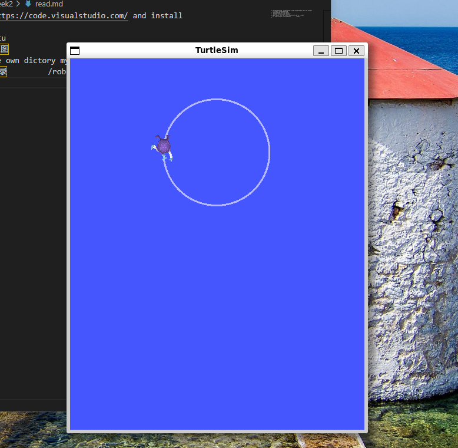
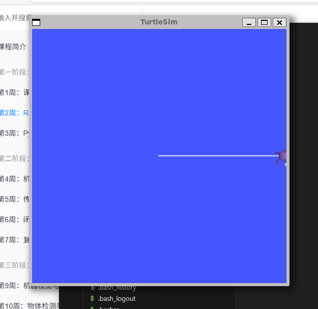

## 运行小乌龟程序并且画圈画圆

- 1 chorome download  vscode https://code.visualstudio.com/ and install  
  浏览器下载 vscode 并且安装  
- 2  download WSL and run ubuntu  
   下载WSL 并且运行上节课的乌班图   
- 3 open ubuntu root and create own dictory my is  /robot   
  打开乌班图根目录 创建自己的目录         /robot    
- 4  create ssh secret and clone git  repository  
   创建ssh 密钥并且克隆远程仓库到虚拟机  
   https://zhuanlan.zhihu.com/p/688103044 
- 5  learn ros order  
   学习 ros 命令  
- 6  example  举例 
  ORDER1:  ros2 run turtlesim turtlesim_node   
    //run turtle  运行小乌龟  
  open anther window  打开另外一个窗口  

  ORDER2:  ros2 topic pub /turtle1/cmd_vel geometry_msgs/msg/Twist "{linear: {x: 1.0, y: 0.0, z: 0.0}, angular: {x: 0.0, y: 0.0, z: 0.0}}" 
    //小乌龟画圈 见效果图  
      
  //run turtle as line see in picture  让小乌龟按线性前进 效果见截图   
  ORDER3: ros2 topic echo /turtle1/pose     
  //listen turtle postion  see in picture  
   监听小乌龟坐标 效果见截图    
         

