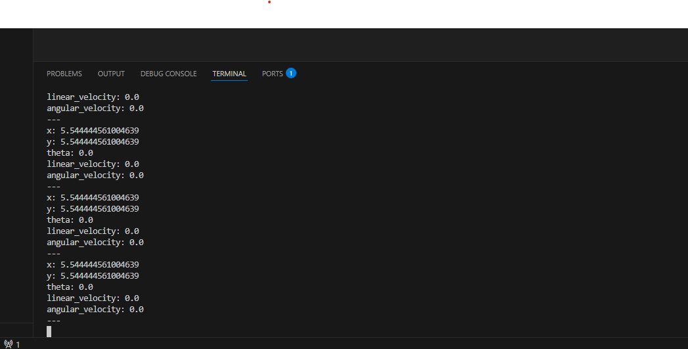

# Week 03 - turtlesim 运动控制与话题监听

本周学习 ROS2 常用命令，使用话题发布控制 turtlesim 运动，并通过话题监听观察小乌龟的位置变化。

## 本周目标

- 安装并使用 VSCode 连接 WSL/Ubuntu 开发环境。
- 熟悉 ROS2 的 `run`、`topic pub`、`topic echo` 等命令。
- 控制 turtlesim 前进、转向和画圆。
- 监听 `/turtle1/pose` 话题，理解机器人状态反馈。

## 文件说明

| 文件 | 说明 |
| :--- | :--- |
| `README.md` | 本周实验记录。 |
| `小乌龟画圈.png` | 发布速度指令后画圆的效果。 |
| `小乌龟运动.png` | 小乌龟直线运动截图。 |
| `监听小乌龟位置.png` | 监听 pose 话题的终端截图。 |

## 环境准备

1. 安装 VSCode，并安装 WSL 远程开发扩展。
2. 在 Ubuntu 中创建课程目录，例如：

```bash
mkdir -p ~/robot
cd ~/robot
```

3. 配置 Git 与 SSH 密钥后，将课程仓库克隆到本地。

## 运行步骤

启动 turtlesim：

```bash
ros2 run turtlesim turtlesim_node
```

打开另一个终端，发布直线速度指令：

```bash
ros2 topic pub /turtle1/cmd_vel geometry_msgs/msg/Twist "{linear: {x: 1.0, y: 0.0, z: 0.0}, angular: {x: 0.0, y: 0.0, z: 0.0}}"
```

发布带角速度的指令，使小乌龟画圆：

```bash
ros2 topic pub /turtle1/cmd_vel geometry_msgs/msg/Twist "{linear: {x: 1.0, y: 0.0, z: 0.0}, angular: {x: 0.0, y: 0.0, z: 1.0}}"
```

监听小乌龟当前位置：

```bash
ros2 topic echo /turtle1/pose
```

## 结果展示

### 画圆效果


### 直线运动


### 位置监听



## 学习总结

本周理解了 ROS2 中“话题发布控制动作、话题监听观察状态”的基本工作方式。`cmd_vel` 用于发送速度控制，`pose` 用于反馈位置和朝向，这也是后续机器人闭环控制的基础。
