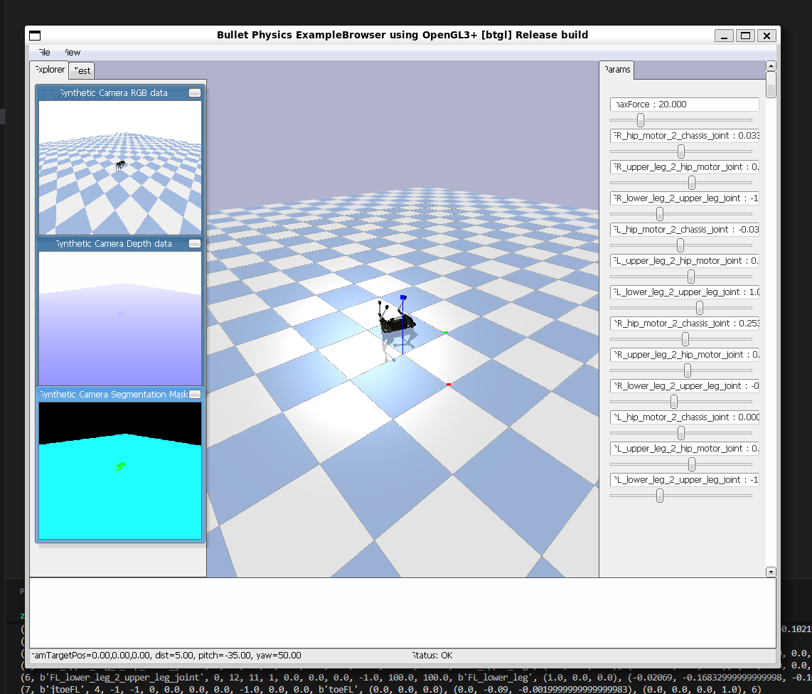
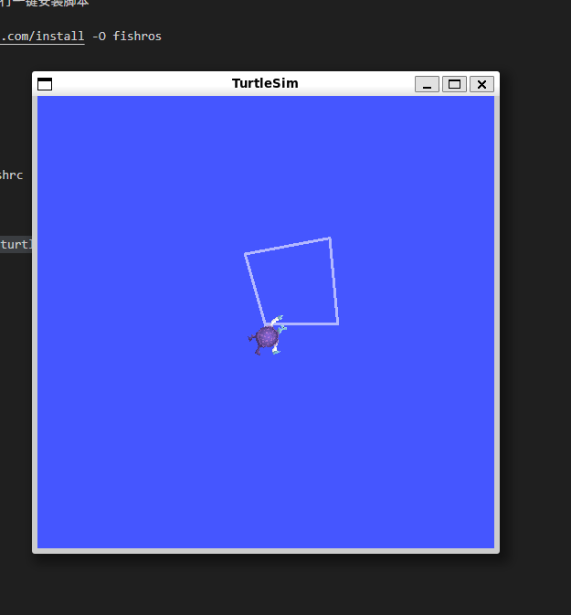

# Week 04 - 机器狗仿真与 turtlesim 正方形轨迹

本周完成 PyBullet 机器狗仿真环境体验，并编写 Python 控制程序让 turtlesim 按正方形轨迹运动。

## 本周目标

- 安装 Python、pip 与 PyBullet。
- 运行机器狗仿真示例，观察模型姿态变化。
- 编写 ROS2 Python 控制脚本。
- 控制 turtlesim 绘制正方形轨迹。

## 文件说明

| 文件 | 说明 |
| :--- | :--- |
| `README.md` | 本周实验说明。 |
| `move.py` | 控制 turtlesim 绘制正方形的 Python 脚本。 |
| `img1dog.png` | PyBullet 机器狗仿真效果图。 |
| `img2Turtle.png` | 小乌龟绘制正方形的效果图。 |

## 环境准备

安装 Python 与 pip：

```bash
sudo apt update
sudo apt install python3 python3-pip
```

安装 PyBullet：

```bash
pip3 install pybullet
```

## 实验一：运行机器狗仿真

创建机器狗实验目录并下载课程示例代码：

```bash
mkdir -p ~/robotdog
cd ~/robotdog
git clone https://github.com/bulletphysics/pybullet_robots.git
```

进入示例目录后运行 Laikago 相关脚本：

```bash
python3 laikago.py
```

运行后可以观察机器狗模型的启动、姿态变化和关节运动。



## 实验二：绘制正方形轨迹

启动 turtlesim：

```bash
ros2 run turtlesim turtlesim_node
```

在本目录运行控制脚本：

```bash
python3 move.py
```

脚本通过周期性发布 `/turtle1/cmd_vel` 速度指令，让小乌龟完成直行和转向，从而形成正方形轨迹。



## 学习总结

本周从两个方向理解机器人控制：PyBullet 用于观察多关节机器人仿真，turtlesim 用于练习 ROS2 速度控制。通过 `move.py`，进一步熟悉了用 Python 编写 ROS2 控制逻辑的方法。
