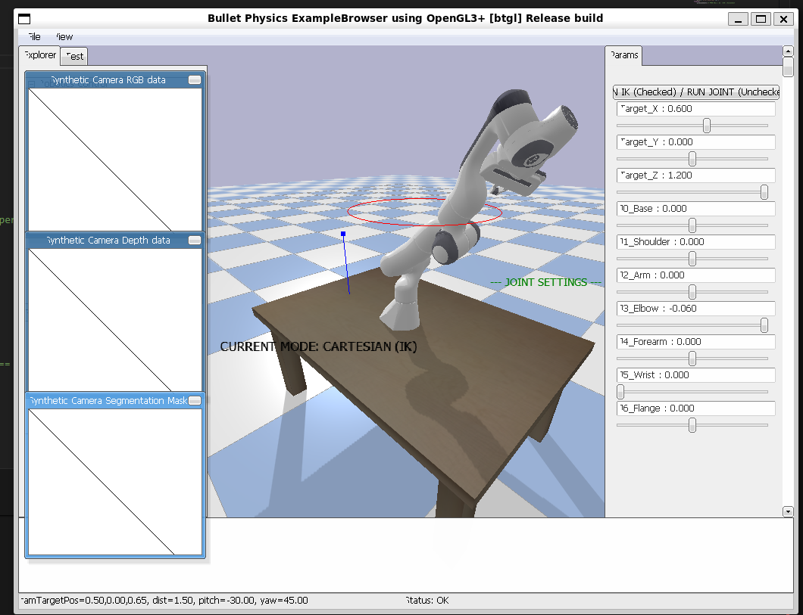
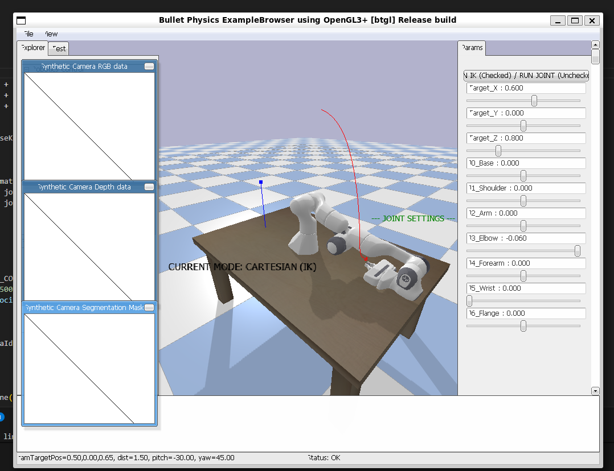

## week4  让机器人画圆 画线
  -  运行机器人代码 //create folder run  python3 demo01_panda.py        
  -  修改代码画圆 详见cycle_panda.py //edit runcycle  des cycle_panda.py  
  -    -      
  -    2026-04-01 drawcycle.mp4  
  - 修改代码 画线 详见line_panda.py//edit drawline  des 详见line_panda.py  
  -    -      
  -  2026-04-01  runline.mp4  
