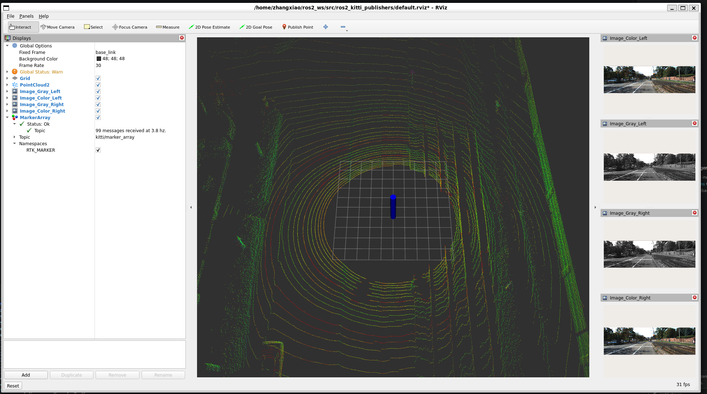
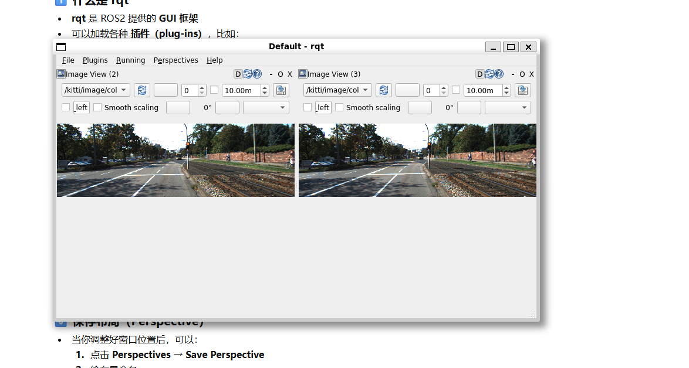

## week6 运行ros2_ws 项目 并且实现全景监控
-  1 new folder ros2_ws and    git clone https://github.com/ai-robot-class/ros2_kitti_publishers.git   
    新建文件夹ros2_ws 克隆git 项目  
- 2 download  imagedata  https://drive.google.com/file/d/1lCOOkoUp1RRrFhUwRVNVwRWIclv-etBu/view?usp=drive_link 
  下载资源图片文件 
- 3 copy data to \\wsl.localhost\Ubuntu-22.04\home\zhangxiao\ros2_ws\data     
- 4 build and run    //编译并且执行下面的命令 
   cd ~/ros2_ws 
   colcon build --cmake-clean-cache 
   source ./install/setup.bash 
   ros2 run ros2_kitti_publishers kitti_publishers 
- 5 open another terminal run   //打开一个新的窗口运行 新的命令 
   ros2 daemon start 
   rviz2   
- 6 set cofig   on the window    //在运行出的界面上设置config 
    file/openConfig  "\\wsl.localhost\Ubuntu-22.04\home\zhangxiao\ros2_ws\src\ros2_kitti_publishers\default.rviz"  
     save  
         
- 7 back first terminal run     //返回第一个窗口运行命令 
  ros2 run ros2_kitti_publishers kitti_publishers 
    
 

