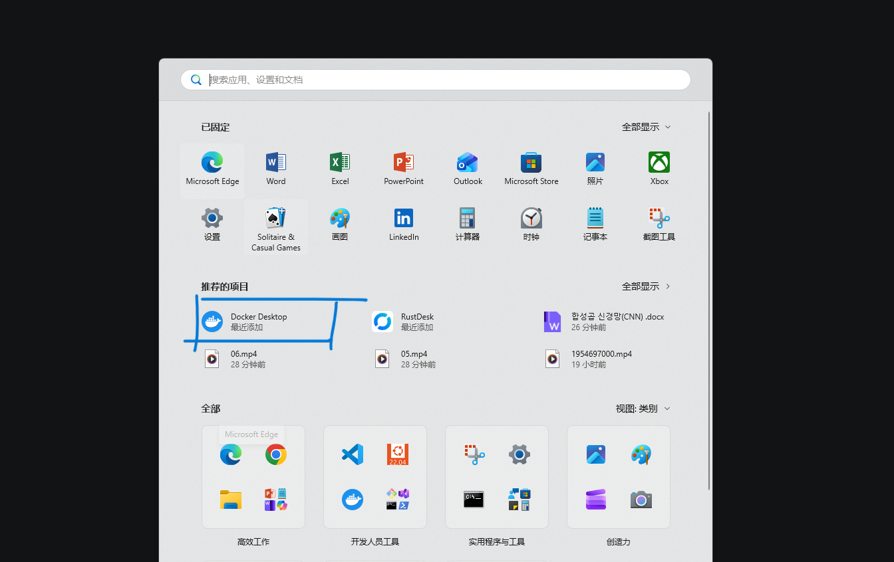
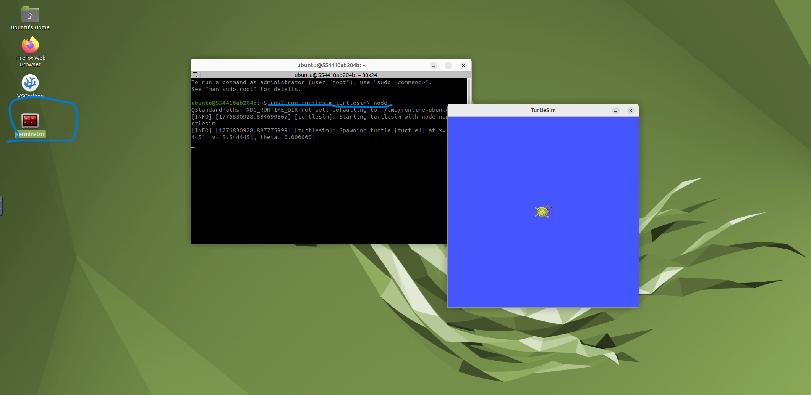

# Week 08 - Docker ROS2 桌面环境与 turtlesim 运行

本周使用 Docker 搭建 ROS2 桌面环境，并通过浏览器访问容器中的 Ubuntu 图形界面，成功运行 turtlesim。

## 本周目标

- 安装并启动 Docker。
- 运行 ROS2 Humble 桌面容器。
- 通过浏览器访问容器图形界面。
- 在容器中运行 turtlesim 示例程序。

## 文件说明

| 文件 | 说明 |
| :--- | :--- |
| `README.md` | 本周实验说明。 |
| `docker.png` | Docker 安装或运行截图。 |
| `turtle.png` | 容器中运行 turtlesim 的效果截图。 |

## Docker 环境准备

在 Windows 中安装 Docker Desktop，并确保 WSL2 集成正常开启。

安装完成后，可以在 PowerShell 中检查 Docker：

```powershell
docker --version
```

## 启动 ROS2 桌面容器

使用课程推荐镜像运行 ROS2 Humble 桌面环境：

```powershell
docker run -p 6080:80 --security-opt seccomp=unconfined --shm-size=512m ghcr.io/tiryoh/ros2-desktop-vnc:humble
```

容器启动后，在浏览器访问：

```text
http://127.0.0.1:6080/
```

即可看到 Ubuntu 桌面环境。

## 运行 turtlesim

在容器桌面中打开终端，执行：

```bash
ros2 run turtlesim turtlesim_node
```

## 结果展示

### Docker 运行效果



### turtlesim 运行效果



## 学习总结

本周理解了 Docker 在机器人开发中的作用。通过容器运行 ROS2，可以减少本机环境差异带来的问题，也便于后续快速复现开发环境。
