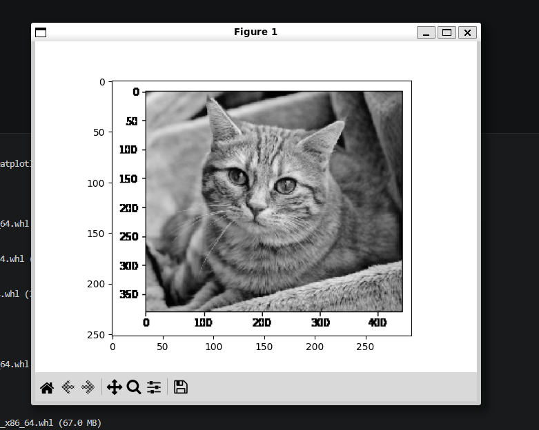
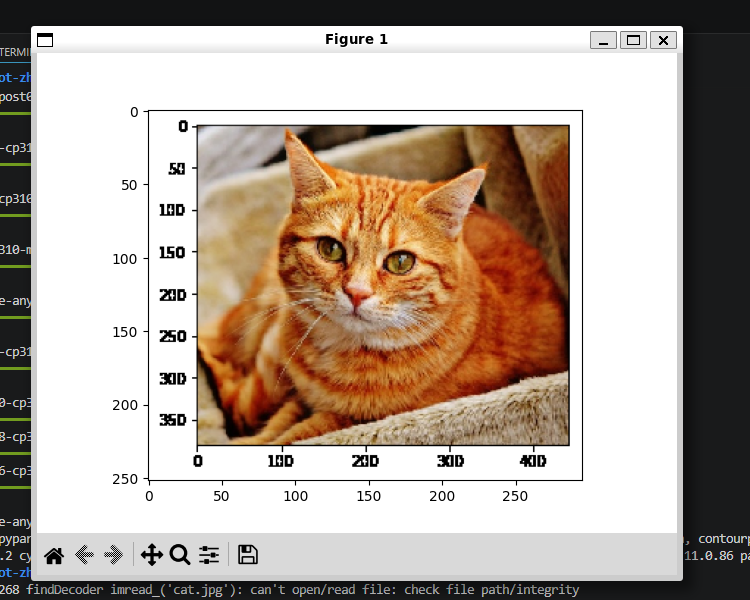

# Week 10 - Docker 目录挂载与 OpenCV 图像处理

本周学习 Docker 容器目录挂载，并在容器环境中安装 OpenCV，完成简单图像处理实验。

## 本周目标

- 使用 Docker 的 `-v` 参数挂载本地目录。
- 理解宿主机目录与容器目录的同步关系。
- 在 Ubuntu/ROS2 容器中安装 OpenCV。
- 编写并运行图像处理脚本。

## 文件说明

| 文件 | 说明 |
| :--- | :--- |
| `README.md` | 本周实验说明。 |
| `test.py` | OpenCV 图像处理测试脚本。 |
| `cat.png` | 原始测试图片。 |
| `garyCat.png` | 灰度处理结果图。 |
| `lightCat.png` | 亮度处理结果图。 |

## 启动挂载目录的容器

在 PowerShell 中运行：

```powershell
docker run -p 6080:80 --security-opt seccomp=unconfined --shm-size=512m -v C:\zhangxiao\robot:/home/ws ghcr.io/tiryoh/ros2-desktop-vnc:humble
```

参数说明：

- `-p 6080:80`：将容器 Web 桌面映射到本机 6080 端口。
- `-v C:\zhangxiao\robot:/home/ws`：将本机目录挂载到容器 `/home/ws`。
- `--shm-size=512m`：增加共享内存，提升图形程序稳定性。

## 安装 OpenCV

进入容器终端后执行：

```bash
pip install opencv-python opencv-contrib-python
```

## 运行图像处理脚本

将 `cat.png` 与 `test.py` 放在同一目录，然后运行：

```bash
python test.py
```

脚本会读取原始图片，并输出灰度图和亮度增强图。

## 结果展示

### 灰度图



### 亮度处理图



## 学习总结

本周掌握了 Docker 目录挂载方法。挂载目录后，可以在 Windows 和容器之间同步代码与数据，这对机器人开发中的数据集处理、日志保存和跨环境调试非常有帮助。
