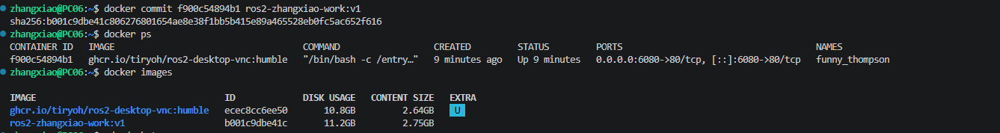
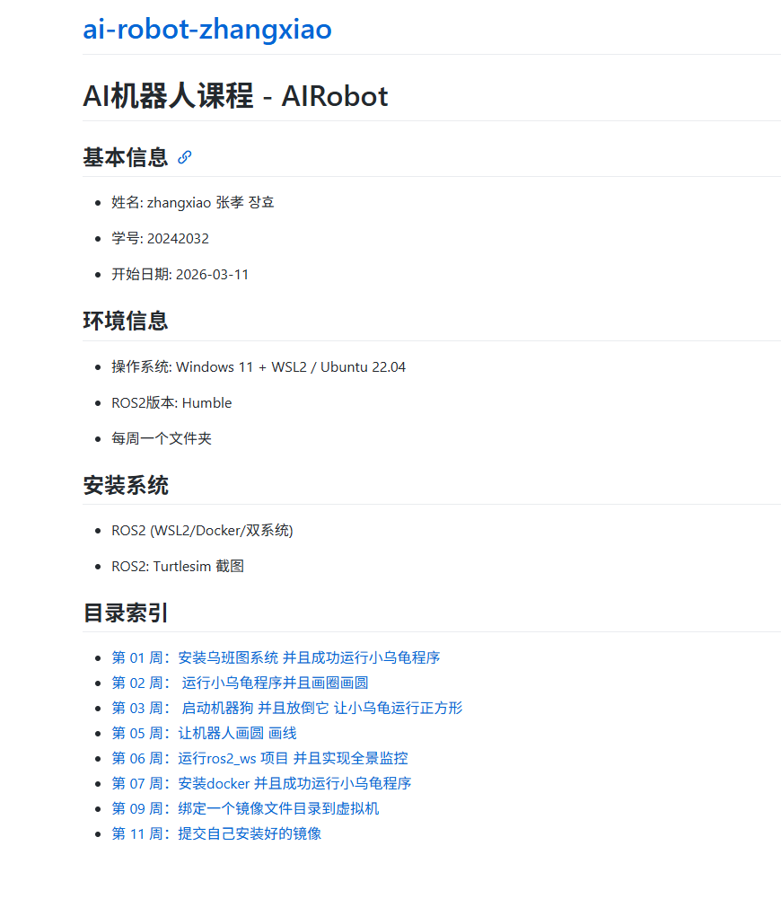

# Week 11 - Docker 镜像提交与 GitHub Pages 展示

本周在已有 ROS2 Docker 环境中安装依赖并提交为个人镜像，同时配置 GitHub Pages 用于展示项目 README。

## 本周目标

- 继续使用带目录挂载的 ROS2 容器。
- 在容器内安装 OpenCV 等依赖。
- 使用 `docker commit` 保存当前容器环境。
- 使用新镜像重新启动容器。
- 配置 GitHub Pages 展示课程项目。

## 文件说明

| 文件 | 说明 |
| :--- | :--- |
| `README.md` | 本周实验说明。 |
| `commit.png` | Docker 镜像提交结果截图。 |
| `readmeimg.png` | GitHub Pages 或 README 展示截图。 |

## 启动基础容器

```powershell
docker run -p 6080:80 --security-opt seccomp=unconfined --shm-size=512m -v C:\zhangxiao\robot:/home/ws ghcr.io/tiryoh/ros2-desktop-vnc:humble
```

## 安装依赖

在容器终端中安装 OpenCV：

```bash
pip install opencv-python opencv-contrib-python
```

## 提交个人镜像

查看正在运行的容器：

```powershell
docker ps
```

将容器提交为个人镜像：

```powershell
docker commit f900c54894b1 ros2-zhangxiao-work:v1
```

查看镜像是否生成：

```powershell
docker images
```

使用新镜像重新启动容器：

```powershell
docker run -p 6080:80 --name my_ros_container ros2-zhangxiao-work:v1
```

## 结果展示

### 镜像提交结果



### README 页面展示



## GitHub Pages 配置

进入 GitHub 仓库设置：

```text
Settings -> Pages -> Build and deployment
```

选择部署分支后，GitHub 会生成在线页面链接，用于展示项目 README 与课程成果。

## 学习总结

本周理解了 Docker 镜像提交的意义：当容器中安装好依赖后，可以将当前状态保存为新镜像，避免每次重新配置环境。同时，GitHub Pages 让课程项目具备了在线展示能力。
