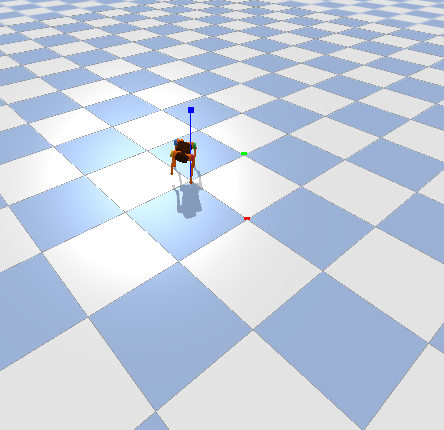

# PyBullet 四足机器人 Trot 步态实现

## 1. 安装 PyBullet

```bash
pip install pybullet numpy
```

安装完成后验证：

```bash
python3 -c "import pybullet as p; print('PyBullet已安装')"
```

---

## 2. 拷贝课程代码

打开课程页面：

https://course.a-real.me/content/week13.html

复制 **13.6.2 Trot步态实现** 的代码，并保存为：

```bash
test.py
```

---

## 3. 运行原始代码

```bash
python3 test.py
```

当前效果：

- 狗子可以站起来
- 但不能稳定行走
- 容易摔倒

---

# 4. 修改代码：让狗子稳定站立并实现行走

---

## 4.1 自动筛选电机关节

通过遍历模型的全部关节，过滤掉固定关节，只保留可旋转的驱动关节：

```python
for i in range(p.getNumJoints(robot_id)):
    info = p.getJointInfo(robot_id, i)
    joint_type = info[2]

    # 仅保留可旋转关节
    if joint_type == p.JOINT_REVOLUTE:
        self.joints.append(i)
```

---

## 4.2 绑定四条腿的关节序号

明确四条腿对应的物理关节 ID。

每条腿的顺序严格为：

```text
[侧摆, 大腿前摆, 小腿屈伸]
```

例如：

```python
self.legs = {
    "FL": [0, 1, 2],    # 左前
    "FR": [3, 4, 5],    # 右前
    "RL": [6, 7, 8],    # 左后
    "RR": [9, 10, 11]   # 右后
}
```

---

## 4.3 生成对角 Trot 步态轨迹

利用正弦波生成小跑（Trot）步态：

- FR（右前）与 RL（左后）同相
- FL（左前）与 RR（右后）反相
- 两组相差 π（180°）

```python
# FR(右前) 和 RL(左后) 同相
# FL(左前) 和 RR(右后) 反相

if leg_name in ["FR", "RL"]:
    swing = amplitude * np.sin(phase)
else:
    swing = amplitude * np.sin(phase + np.pi)

# 大腿与小腿联动
upper_angle = 0.6 + swing
lower_angle = -1.2 - swing
```

步态原理：

- 大腿前摆时
- 小腿反向折叠
- 实现“抬腿”动作

---

## 4.4 机身姿态闭环修正

使用负反馈控制维持机器人平衡。

获取机身姿态：

```python
# Roll 横滚
# Pitch 俯仰

roll, pitch, _ = p.getEulerFromQuaternion(orientation)
```

加入 P 控制器：

```python
# 比例反馈控制

roll_correction = -0.8 * roll
pitch_correction = -0.8 * pitch
```

控制逻辑：

- 身体向左倾斜 → 自动向右修正
- 身体前倾 → 自动向后修正

相当于一个“倒立摆恢复控制”。

---

## 4.5 展平数据并发送控制指令

将四条腿计算得到的 12 个目标角度统一发送给电机。

```python
# 叠加平衡补偿
angles[0] += roll_correction
angles[1] += pitch_correction
```

一次性发送控制命令：

```python
p.setJointMotorControlArray(
    bodyIndex=self.robot,
    jointIndices=self.joints,
    controlMode=p.POSITION_CONTROL,
    targetPositions=all_targets
)

# 推进物理仿真
p.stepSimulation()
```

---

# 5. 运行效果

运行：

```bash
python3 test.py
```

效果：

- 四足机器人可以稳定站立
- 能够实现 Trot 小跑步态
- 身体具备一定自平衡能力

---

## 效果图

```markdown

```

---

## 演示视频

```markdown
![[radio.mp4]]
```
