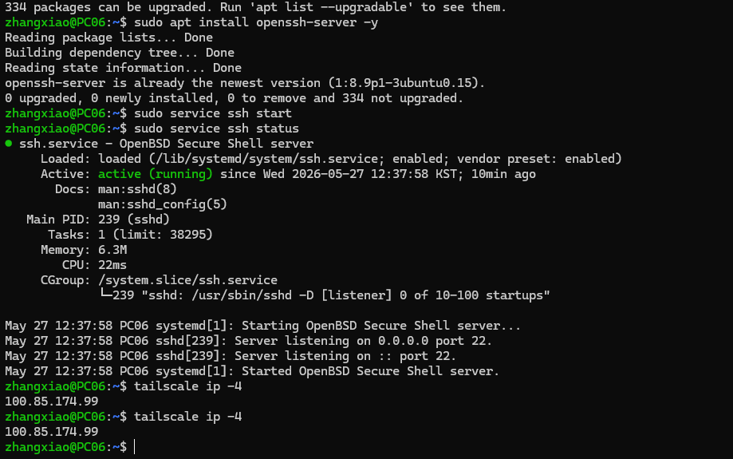
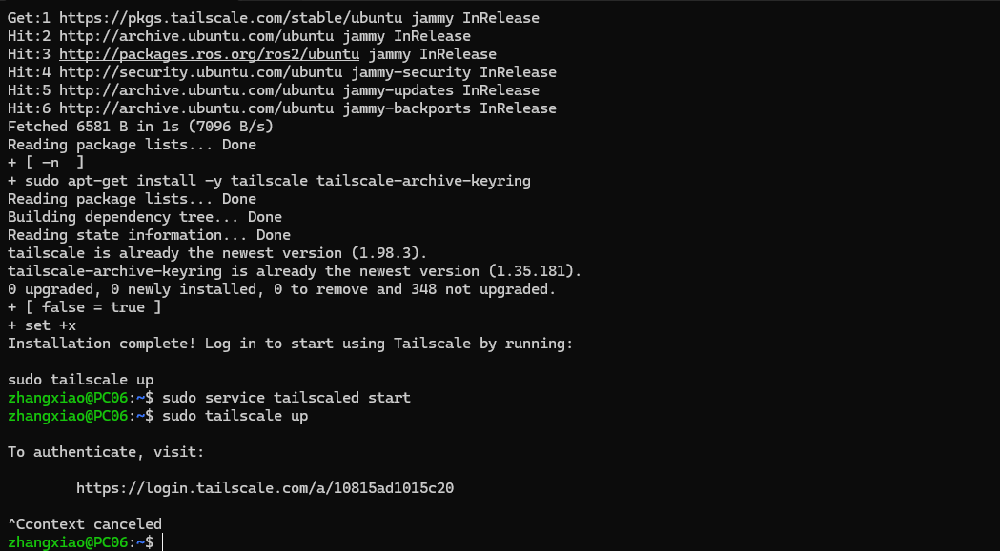

# Week 13 - Tailscale 与 WSL 远程连接

本周配置 Tailscale 虚拟局域网，实现手机端远程连接 WSL/Ubuntu 环境，并准备远程调试与图像传输相关脚本。

## 本周目标

- 在 WSL 中安装并启动 Tailscale。
- 在手机端登录同一个 Tailscale 账号。
- 使用 Termius 或 SSH 工具远程连接 WSL。
- 验证远程网络连通性。
- 了解 `camera_bridge.py` 的远程图像桥接用途。

## 文件说明

| 文件 | 说明 |
| :--- | :--- |
| `README.md` | 本周配置说明。 |
| `camera_bridge.py` | 摄像头或图像数据桥接脚本。 |
| `requirements.txt` | Python 依赖列表。 |
| `result.jpg` | 运行结果或图像传输效果。 |
| `wsl1.png` | WSL/Tailscale 配置截图。 |
| `wsl2.png` | 远程连接效果截图。 |

## 安装 Tailscale

在 WSL 终端执行：

```bash
curl -fsSL https://tailscale.com/install.sh | sh
sudo service tailscaled start
sudo tailscale up
```

执行 `sudo tailscale up` 后，终端会输出登录链接。打开链接并完成账号授权后，WSL 会加入当前 Tailscale 私有网络。

## 手机端配置

1. 在手机上安装 Tailscale。
2. 使用与 WSL 相同的账号登录。
3. 确认手机和 WSL 设备都出现在同一个 Tailscale 网络中。
4. 记录 WSL 设备的 Tailscale IP 地址。

## SSH 远程连接

在 WSL 中确认 SSH 服务可用：

```bash
sudo apt update
sudo apt install openssh-server
sudo service ssh start
```

在手机 Termius 中新建连接：

```text
Host: WSL 的 Tailscale IP
Port: 22
Username: Ubuntu 用户名
Password/Key: 对应密码或密钥
```

连接成功后，即可在手机端远程运行命令和调试程序。

## Python 依赖

如果需要运行 `camera_bridge.py`，先安装依赖：

```bash
pip install -r requirements.txt
```

运行脚本：

```bash
python3 camera_bridge.py
```

## 结果展示

### WSL/Tailscale 配置



### 远程连接效果



### 图像结果


## 学习总结

本周完成了远程运维能力建设。Tailscale 可以让手机和 WSL 像处于同一个局域网中一样通信，为后续手机遥控机器人、远程调试 ROS2 节点和查看运行结果提供了网络基础。
