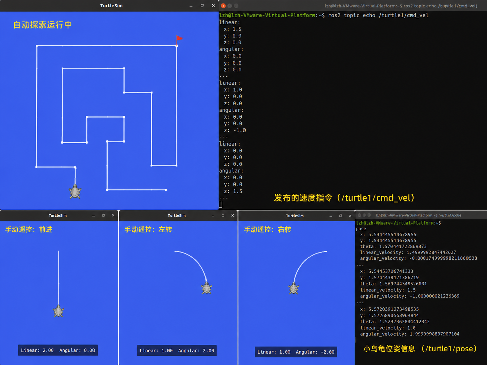

# Week 14 - 手机遥控与自主探索小乌龟系统

本周完成一个基于 ROS2 与 turtlesim 的综合项目：小乌龟机器人既可以通过手机浏览器远程控制，也可以基于巡墙算法进行迷宫自主探索。

## 项目目标

- 构建手机端远程控制界面。
- 通过 HTTP 或 WebSocket 将手机指令发送到电脑端服务。
- 使用 Python Bridge Server 将网页指令转换为 ROS2 控制消息。
- 向 `/turtle1/cmd_vel` 发布 `geometry_msgs/msg/Twist` 消息控制小乌龟。
- 实现基于 Wall Following 和 Right-Hand Rule 的自主探索逻辑。

## 文件说明

| 文件 | 说明 |
| :--- | :--- |
| `README.md` | 本周综合项目说明。 |
| `explorer.py` | 自主探索控制脚本。 |
| `img1.png` | 手机遥控与自主探索效果截图。 |
| `week14.pdf` | 根据本 README 生成的项目 PDF 报告。 |

## 系统架构

```text
手机浏览器
    ↓
网页控制界面 HTML/JS
    ↓
HTTP / WebSocket
    ↓
Python Bridge Server
    ↓
ROS2 Node
    ↓
/turtle1/cmd_vel
    ↓
turtlesim
```

系统由三层组成：

| 层级 | 作用 |
| :--- | :--- |
| 前端控制层 | 提供手机端按钮界面，发送方向与模式切换指令。 |
| 桥接通信层 | 接收网页请求，解析控制命令，并发布 ROS2 消息。 |
| ROS2 控制层 | 控制 turtlesim 运动，并执行自主探索逻辑。 |

## 功能一：手机远程控制

手机端网页提供以下控制能力：

- 前进 `forward`
- 后退 `backward`
- 左转 `left`
- 右转 `right`
- 手动模式 `manual`
- 自动探索模式 `auto`

前端通过 Fetch API 或 WebSocket 将指令发送到桥接服务。桥接服务根据指令生成 `Twist` 消息，例如：

| 指令 | 线速度 | 角速度 | 效果 |
| :--- | :--- | :--- | :--- |
| `forward` | 正值 | 0 | 向前移动 |
| `backward` | 负值 | 0 | 向后移动 |
| `left` | 0 | 正值 | 左转 |
| `right` | 0 | 负值 | 右转 |

## 功能二：自主探索迷宫

自主探索模块基于经典巡墙算法实现。核心思想是让机器人始终沿着右侧墙壁前进，当遇到不同环境状态时执行不同动作。

### 感知状态

程序维护两个关键状态：

```python
front_blocked
right_open
```

- `front_blocked`：前方是否被墙或边界阻挡。
- `right_open`：右侧是否存在可通行空间。

### 控制策略

| 环境状态 | 线速度 | 角速度 | 执行动作 |
| :--- | :--- | :--- | :--- |
| 前方有障碍 | 0.0 | +1.5 | 原地左转 |
| 右侧空旷 | 1.0 | -1.0 | 向右贴墙 |
| 正常巡墙 | 1.5 | 0.0 | 直线前进 |

核心控制逻辑：

```python
def p_control_loop(self):
    if self.front_blocked:
        self.msg.linear.x = 0.0
        self.msg.angular.z = 1.5
    elif self.right_open:
        self.msg.linear.x = 1.0
        self.msg.angular.z = -1.0
    else:
        self.msg.linear.x = 1.5
        self.msg.angular.z = 0.0

    self.publisher_.publish(self.msg)
```

## 运行准备

启动 ROS2 环境：

```bash
source /opt/ros/humble/setup.bash
```

启动 turtlesim：

```bash
ros2 run turtlesim turtlesim_node
```

运行自主探索脚本：

```bash
python3 explorer.py
```

如果使用手机遥控，还需要确保手机与电脑位于同一局域网，或通过 Tailscale 加入同一个虚拟局域网。

## 测试结果

### 手动遥控测试

测试内容：

- 前进、后退、左转、右转控制。
- 手动模式和自动模式切换。
- 手机端指令发送与 ROS2 节点接收。

测试结果：控制指令可以正常发送，小乌龟运动响应流畅，局域网通信稳定。

### 自动探索测试

测试内容：

- 墙体跟随能力。
- 转角识别能力。
- 死胡同处理能力。
- 连续探索能力。

测试结果：小乌龟能够基于右手法则持续巡墙，自动绕过障碍区域，并完成连续探索。

## 效果展示



## 项目总结

本周项目将前几周学习的 ROS2 控制、远程连接、网页通信和路径探索算法结合起来，形成了一个完整的小型机器人系统。项目验证了从手机端输入到 ROS2 控制输出的完整链路，也为后续接入真实移动机器人平台提供了实践基础。

## 后续改进方向

- 引入激光雷达或深度相机模拟。
- 使用 SLAM 构建地图。
- 增加最短路径规划能力。
- 支持多机器人协同探索。
- 将 turtlesim 逻辑迁移到真实移动机器人平台。
